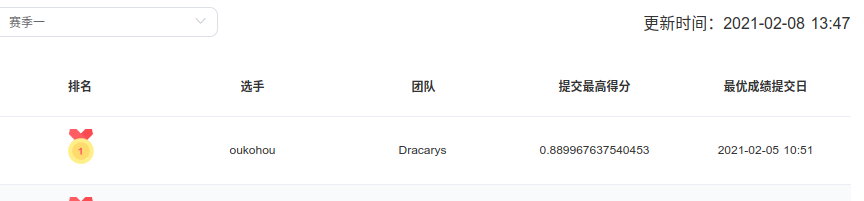
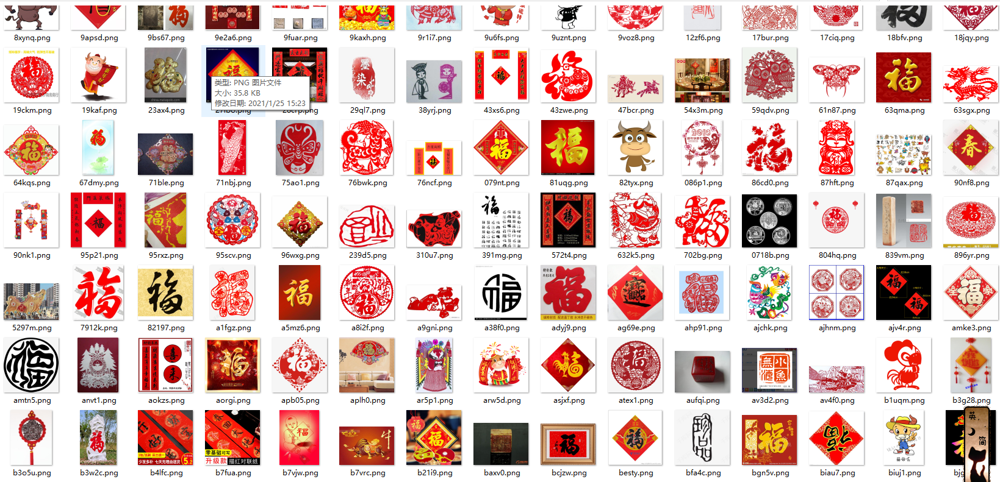
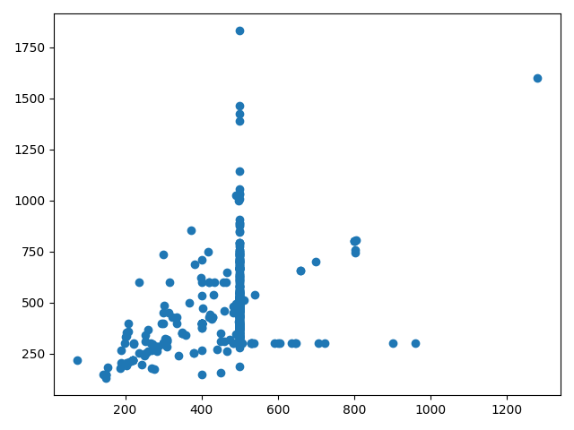
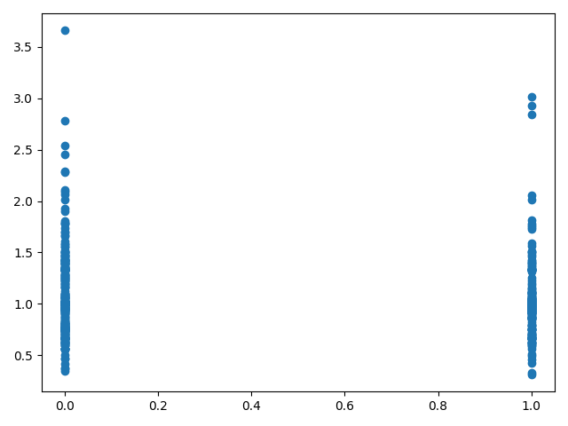

>_author_   :   oukohou  
>_time_     :   2021-02-08 8:15:55   
>_email_    :   oukohou@outlook.com

### 0. 不需要关注公众号，也不需要转发朋友圈，只求您大手一挥，`star`、`fork`、`follow` 三连！！！！  
敬请持续关注，如果最终能得名次，会在我的知乎专栏[深度学习深度学习](https://www.zhihu.com/column/oukohou-DL)、 我的个人博客[璇珠杂俎](https://www.oukohou.wang)上分享比赛心得及技巧～～  

### 1. train：  
- pip install -r requirments.txt  
- 修改 `train_model.py` 里的训练参数  
- python train_model.py  

一个常识:好的预训练是成功的一半,最好还是用预训练好的模型进行初始化.  

### 2. predict：
- 修改 `inference_model.py` 里的预测参数  
- python inference_model.py   

### 3. score：  
模型选用resnext101_32x4d, 先用mixup训练30epoch后,在用正常的数据微调模型后,预测得分`0.889967637540453`:  

  
截止到 2021-02-08 13:47 排名仍为 *top1*!!!倾囊相授啊朋友们!!!      

### 4. 最重要的：  
不需要关注公众号，也不需要转发朋友圈，只求您大手一挥，`star`、`fork`、`follow` 三连！！！！  
敬请持续关注，如果最终能得名次，会在我的知乎专栏[深度学习深度学习](https://www.zhihu.com/column/oukohou-DL)、 我的个人博客[璇珠杂俎](https://www.oukohou.wang)上分享比赛心得及技巧～～

### 5. 更多上分 tips:

- 数据分布:  
万物之源:  **最重要的是对数据的理解~~**  

图片一览:  

横轴为宽,竖轴为高:  
  

横轴为标签(0,1),竖轴为长宽比例:    
    

