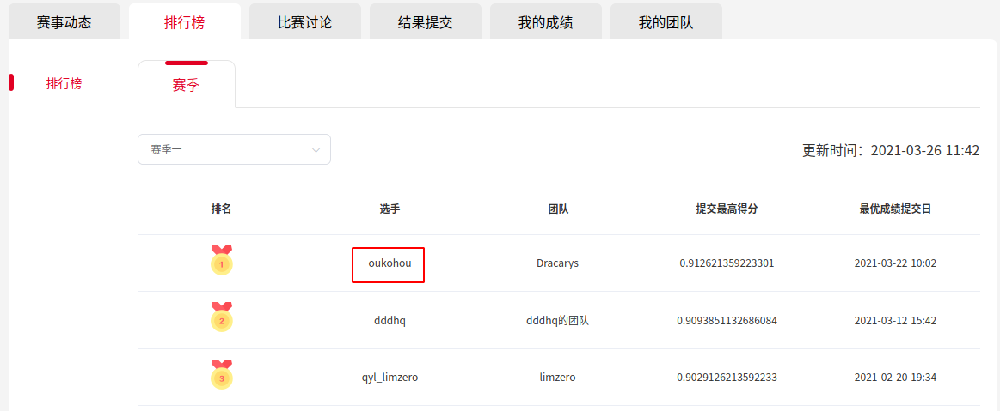

>_author_   :   oukohou  
>_time_     :   2021-02-08 8:15:55   
>_email_    :   oukohou@outlook.com

update 2021-03-29 18:01:27:  
荣获top1!  
  

回馈新老观众,特地赶来更新!  
就冲我这么实在,还不给我个star/fork/follow三连?    

话不多说了,直接上干货:  
- 更多模型  
  我在resnext之外还尝试了fcanet、efficient、hrnet、cspdarknet、inception,各位有别的分类模型也可以尝试;  
- 模型集成   
  一般来说,模型差异越大,集成效果越好;  
  集成相似性较高的模型,有时反而会效果更差;  
- 屠龙神技    
  测试时使用相比于训练时稍大一些的分辨率;  
  比如resnext101_32x4d,训练时使用224分辨率,测试时可以尝试300分辨率,有时会有奇效;  
  注意!该方法并不具备普适性,有时反而会效果更差.
还是感谢主办方[Mars数据科学平台](https://www.marsbigdata.com/)给了一次锻炼的机会,同时其他选手也很棒!  
最后还是多交代一句,万物之源:  **最重要的是对数据的理解~~**    

**最后的最后,还是厚着脸皮给自己打个广告:**    
我的另一个github repo:  [李云龙二次元风格化!一键fork你也能行!](https://github.com/oukohou/PaddleGAN-develop),
求各位移步观看,那个repo是参加另一个比赛的,repo的star和fork数会直接计入排名,在此跪求各位大佬赏脸给个star!
视频素材用的是李云龙名场面：    
**你咋不敢跟旅长干一架呢**！→**旅长我给你跪下了**
  

你们去看看呀,很有意思的!  

=====  

### 0. 不需要关注公众号，也不需要转发朋友圈，只求您大手一挥，`star`、`fork`、`follow` 三连！！！！  
敬请持续关注，如果最终能得名次，会在我的知乎专栏[深度学习深度学习](https://www.zhihu.com/column/oukohou-DL)、 我的个人博客[璇珠杂俎](https://www.oukohou.wang)上分享比赛心得及技巧～～  

### 1. train：  
- pip install -r requirments.txt  
- 修改 `train_model.py` 里的训练参数  
- python train_model.py  

一个常识:好的预训练是成功的一半,最好还是用预训练好的模型进行初始化.  

### 2. predict：
- 修改 `inference_model.py` 里的预测参数  
- python inference_model.py   

### 3. score：  
模型选用resnext101_32x4d, 先用mixup训练30epoch后,在用正常的数据微调模型后,预测得分`0.889967637540453`:  

  
截止到 2021-02-08 13:47 排名仍为 *top1*!!!倾囊相授啊朋友们!!!      

### 4. 最重要的：  
不需要关注公众号，也不需要转发朋友圈，只求您大手一挥，`star`、`fork`、`follow` 三连！！！！  
敬请持续关注，如果最终能得名次，会在我的知乎专栏[深度学习深度学习](https://www.zhihu.com/column/oukohou-DL)、 我的个人博客[璇珠杂俎](https://www.oukohou.wang)上分享比赛心得及技巧～～

### 5. 更多上分 tips:

- 数据分布:  
万物之源:  **最重要的是对数据的理解~~**  

图片一览:  

横轴为宽,竖轴为高:  
  

横轴为标签(0,1),竖轴为长宽比例:    
    

